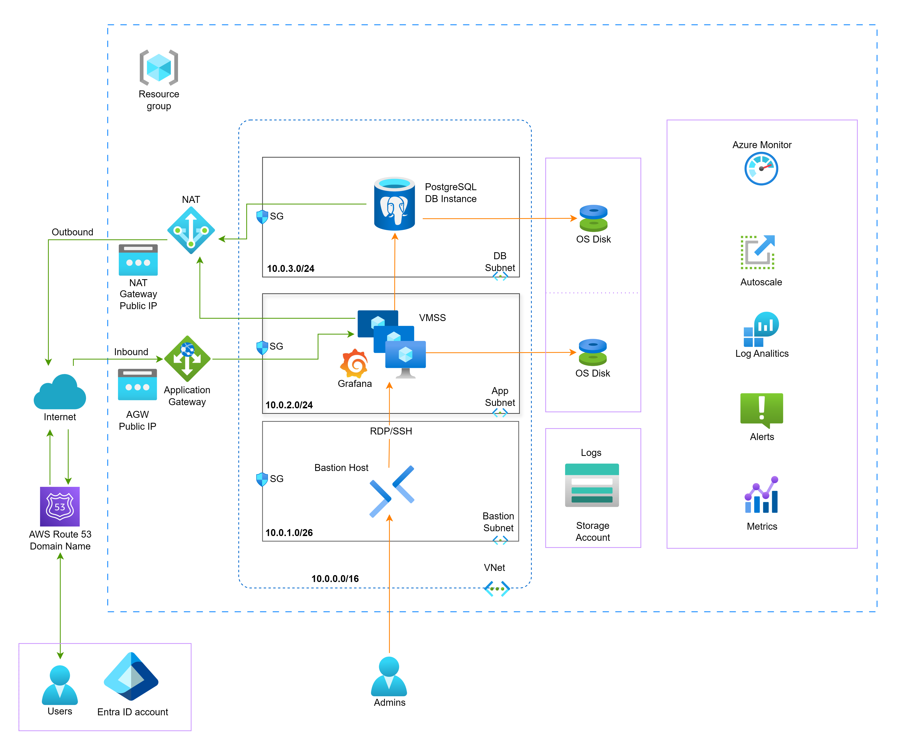
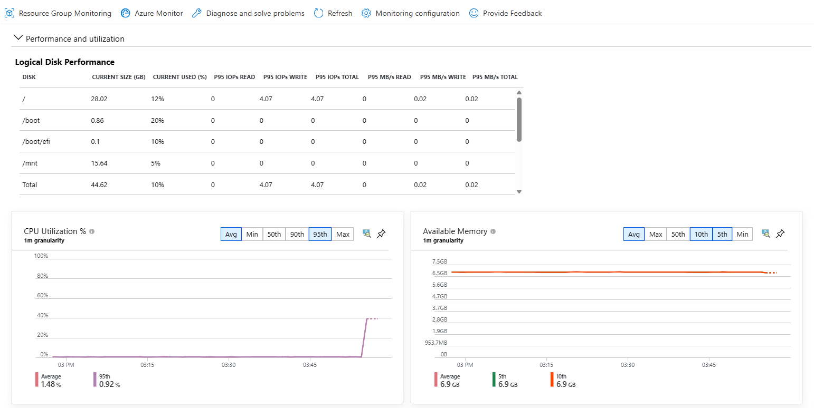
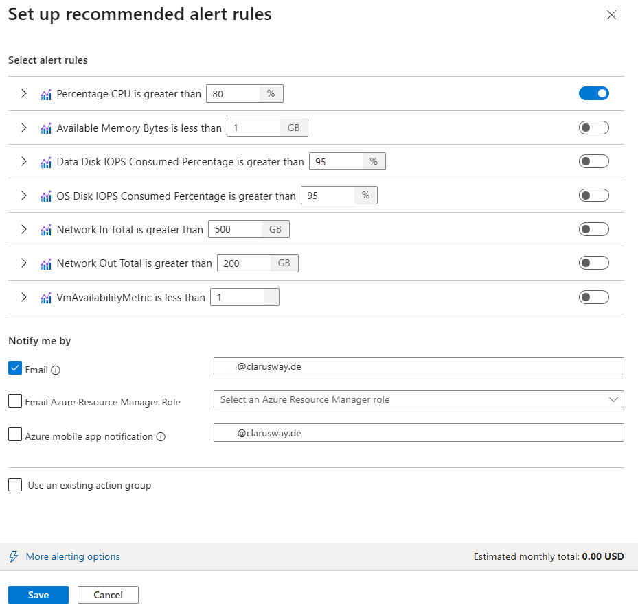

# 🚀 Project-401: Grafana Service on Azure VMSS with Application Gateway, PostgreSQL, DNS, NAT Gateway, Bastion, Storage Account, Azure Monitor & Entra ID

## 🔧 Prerequisites
- Active Azure subscription
- IAM permissions: **Contributor** + **User Access Administrator**
- A registered domain name

---

## 🎯 Description
This project demonstrates how to deliver **Grafana as a Service** deployed on Azure.

It deploys:
- **VM Scale Set (VMSS)** running Grafana  
- **PostgreSQL** for persistent data for the Grafana dashboards  
- **Azure Application Gateway** + **AWS Route 53 DNS** for ingress  
- **Azure NAT Gateway** for outbound Internet  
- **Azure Bastion Host** for secure admin access  
- **Azure Storage Account** for logs  
- **Azure Monitor** for metrics, alerts, autoscale, and log analytics  
- **Azure Entra ID** (OAuth2) for authentication  

This setup can be extended to a multi-tenant “Grafana as a Service”.

---

## 🏗️ High-Level Architecture


| Component | Purpose |
|------------|----------|
| **Resource Group** | Groups project resources |
| **VNet & Subnets** | Network isolation for DB, VMSS, and Bastion |
| **VMSS (Linux)** | Hosts scalable Grafana instances |
| **PostgreSQL** | Stores Grafana configuration & dashboards |
| **Application Gateway** | Handles HTTPS and load balancing |
| **NAT Gateway** | Outbound Internet access for private subnets |
| **Bastion** | Secure SSH/RDP access |
| **Storage Account** | Central log repository |
| **Azure Monitor** | Metrics, alerts, autoscale, and analytics |
| **Entra ID** | Secure SSO for Grafana |
| **AWS Route 53 DNS** | Domain name resolution |

---

## ✨ Key Features
- **Scalable** VMSS with autoscaling  
- **Isolated DB** per customer (PostgreSQL)  
- **SSO** via Azure Entra ID  
- **Hardened Access** with Azure Bastion  
- **Comprehensive Monitoring** via Azure Monitor  
- **Future Ready:** Extendable to AKS, WAF, multi-region

---

## ✅ Expected Outcomes
Participants will:
- Deploy Grafana backed by PostgreSQL  
- Implement secure and scalable VMSS + App Gateway  
- Integrate NAT Gateway, Bastion, and Storage Accounts  
- Learn observability via Azure Monitor  
- Configure Entra ID SSO  
- Design SaaS-style, multi-tenant Azure architecture  

---

## 📚 References
- [Grafana Installation](https://grafana.com/docs/grafana/latest/setup-grafana/installation/)
- [Grafana OAuth2 Auth](https://grafana.com/docs/grafana/latest/setup-grafana/configure-security/configure-authentication/oauth/)
- [App Registration with Microsoft ID Platform](https://learn.microsoft.com/en-us/azure/active-directory/develop/quickstart-register-app)
- [Azure AD SSO with Grafana](https://learn.microsoft.com/en-us/azure/active-directory/saas-apps/grafana-tutorial)
- [Azure Bastion](https://learn.microsoft.com/en-us/azure/bastion/bastion-overview)
- [Azure NAT Gateway](https://learn.microsoft.com/en-us/azure/virtual-network/nat-gateway/nat-overview)
- [Azure Monitor Overview](https://learn.microsoft.com/en-us/azure/azure-monitor/overview)

---

## 🧱 Preparations
- Clone the repository.
- Replace all instances of `clarusway.us` with **your own domain**.
- Delete `.git` folder.
- Push the repository to your GitHub.
- Don't push any Entra ID or DB credentials to GitHub.

---

## 🧩 Network & Foundational Components

Before deploying VMs, databases, and Grafana, we first build the networking foundation. These are the steps to create the network and foundational components:

### Create Resource Group
- Create a **resource group** to contain all project resources (VNet, subnets, NSGs, NAT, Bastion, etc.).
- Use meaningful naming (e.g., `grafana-rg`) to reflect purpose and lifecycle.
- Keep `East US` as the region. 
- Click Create.

### Provision Virtual Network (VNet) and Bastion
- Select the related subscription and the resource group.
- **Virtual network name**: `grafana-vnet`.
- Under the **Security** tab, select the `Enable Azure Bastion` option. That will create a Bastion Host with a public IP address.
- Under the IP Addresses tab, define an appropriate address space, keeping the default is ok (e.g., `10.0.0.0/16`).
- This VNet will host subnets such as application, database, bastion, etc.

### Network Security Groups (NSGs)

- To enforce subnet-level security, define one NSG per subnet according to the information below.
- First, create the NSG. And then add inbound rules.

#### Database Subnet NSG (`db-subnet-sg`)
- **Purpose:** Enable access to PostgreSQL from VMs.  
- **Rules:**
  - ✅ Allow inbound **5432 (PostgreSQL)** only from the IP range of `app-subnet` (10.0.2.0/24)
    - Source: IP Addresses
    - Source IP addresses/CIDR ranges: `10.0.2.0/24`
    - Source port ranges: *
    - Destination: Any
    - Service: PostgreSQL
    - Action: Allow
    - Priority: `1000`
    - Name: `allow-app-to-db-5432`
    - Description: `Allow PostgreSQL traffic from app-subnet (VMSS).`
  - ✅ Allow inbound **22 (SSH)** **only from Bastion subnet (`10.0.1.0/26`)**  
    - Source: IP Addresses  
    - Source IP addresses/CIDR ranges: `10.0.1.0/26`  
    - Source port ranges: *  
    - Destination: Any  
    - Service: SSH  
    - Action: Allow  
    - Priority: `1010`  
    - Name: `allow-bastion-to-db-ssh`  
    - Description: `Allow SSH access to DB instances only via Azure Bastion subnet.` 

#### Application Subnet NSG (`app-subnet-sg`)
- **Purpose:** Host Grafana VMSS and expose it securely.  
- **Rules:**
  - ✅ Allow inbound **22 (SSH)** **only from Bastion subnet (`10.0.1.0/26`)**  
    - Source: IP Addresses  
    - Source IP addresses/CIDR ranges: `10.0.1.0/26`  
    - Source port ranges: *  
    - Destination: Any  
    - Service: SSH  
    - Action: Allow  
    - Priority: `1000`  
    - Name: `allow-bastion-to-vmss-ssh`  
    - Description: `Allow SSH access to VMSS instances only via Azure Bastion subnet.`  
  - ✅ Allow inbound **80 (HTTP)** from Internet  
    - Source: Any  
    - Source port ranges: *  
    - Destination: Any
    - Service: HTTP  
    - Action: Allow  
    - Priority: `1010`  
    - Name: `allow-http-internet`  
    - Description: `Allow public web (HTTP) traffic to Grafana through the Application Gateway.`  
  - ✅ Allow inbound **443 (HTTPS)** from Internet  
    - Source: Any  
    - Source port ranges: *  
    - Destination: Any  
    - Service: HTTPS  
    - Action: Allow  
    - Priority: `1020`  
    - Name: `allow-https-internet`  
    - Description: `Allow public secure (HTTPS) traffic to Grafana through the Application Gateway.`

### Define Subnets
- Open the page of the VNet we just created
- Navigate to `Settings` on the left side menu.
- Open `Subnets`.
- A default subnet and a subnet for Bastion is automatically created during the previous steps.
- See the Bastion Subnet is already created here.
- Create the subnets as in the table below, to segment the VNet into subnets for different tiers.
- Keep **Subnet purpose** as `Default`
- Assign names and IP ranges as below.

| Subnet Name     | Purpose                                  | Range | Feature | Security Group |
|-----------------|------------------------------------------|-------|---------|--------|
| **app-subnet**  | Hosts Grafana VMSS and related services  | 10.0.2.0/24 | | app-subnet-sg |
| **db-subnet**   | Contains the PostgreSQL Server  | 10.0.3.0/24 | Enable private subnet | db-subnet-sg |

- Ensure each subnet’s prefix is non-overlapping and sized appropriately.
- Delete the default Subnet. This is useful to avoid mistakes in the project.

### NAT Gateway (Outbound Internet)
- Deploy an **Azure NAT Gateway** to allow outbound Internet connectivity for VMs in private subnets without assigning public IPs to each VM.
- Required for VMs to download updates and connect to external services.
- Ensures only initiated connections go out, blocking unsolicited inbound traffic by default.

#### Steps to Create a NAT Gateway
- In the Azure Portal, go to **Create a resource** → Search for **NAT Gateway**.
- Fill in the details:
  - **Basics**:
    - **Resource group**: `grafana-rg`
    - **Name**: `grafana-nat`
    - **Region**: Match the VNet region.
    - **Availability zone**: `Zone 1`
    - **TCP idle timeout (minutes)**: `4` (Default) or increase if workloads need longer connections.
  - **Outbound IP**:
    - **Public IP addresses**: Create and assign a **new Public IP** (with name: `nat-ip`).
  - **Subnet**:
    - Select **Virtual Network**: `grafana-vnet`.
    - Select Subnets: `app-subnet` and `db-subnet`.
  - Review and Create.

✅ This setup ensures:
- **VMs** in `app-subnet` and `db-subnet` can access the Internet (e.g., for OS updates, downloading Grafana plugins).
- No **inbound access** is exposed — traffic is strictly one-way.

---

## 🖥️ Project Setup: Compute & Application Components

Once networking is in place, we deploy compute, databases, and application services.

### Provision PostgreSQL on a VM

#### Create the VM
- In the Azure Portal, search for **Virtual Machines** → Click **Create** → **Azure Virtual Machine**.
- Fill in the basics:
  - **Resource group**: Use the same as your project (e.g., `grafana-rg`).
  - **VM name**: `grafana-db-vm`
  - **Region**: Match your VNet region (e.g., `East US`).
  - **Image**: `Ubuntu 24.04 LTS`
  - **Size**: `Standard_D2s_v3` or similar.
  - **Administrator account**:  
    - Authentication type: PSSH key.
    - Username: `azureuser`  
  - **Public inbound ports**: `None` (The inbound rules will be inherited from the subnet)
- **Networking**:
  - Virtual network: `grafana-vnet`
  - Subnet: `db-subnet`
  - Public IP: **None** (for private setup, installations via NAT GW)
- **Advanced**:
  - Under the **Custom data** section, paste the `cloud-init-db.yml` script 
- **Review + Create** → Deploy the VM.


#### Connect to the VM (via Bastion or SSH)
From the Azure Portal:
- Navigate to **grafana-db-vm** → **Connect** → **Connect via Bastion**
- Log in with your pem file for DB VM and `azureuser`


### 🧩 Verify Cloud-Init Logs

After connecting to your VM, execute the command below to see the status of cloud-init:

```bash
sudo cloud-init status --long
```
- **status: done** → cloud-init completed successfully  
- **status: error** → something failed; review logs below
- **status: running** → still running.

- If you want to see what's happening at the moment, use `sudo journalctl -f` to see the details.

#### View main cloud-init logs
```bash
sudo cat /var/log/cloud-init.log
```

#### Verify expected configuration
- Is Postgres configured as expected?
```sh
sudo systemctl status postgresql
# Should output like:
# ● postgresql.service - PostgreSQL RDBMS
#      Loaded: loaded (/usr/lib/systemd/system/postgresql.service; enabled; preset: enabled)
#      Active: active (exited) since Sun 2025-10-12 16:30:55 UTC; 3min 54s ago
#     Process: 9830 ExecStart=/bin/true (code=exited, status=0/SUCCESS)
#    Main PID: 9830 (code=exited, status=0/SUCCESS)
#         CPU: 2ms

# Oct 12 16:30:55 grafana-db-vm systemd[1]: Starting postgresql.service - PostgreSQL RDBMS...
# Oct 12 16:30:55 grafana-db-vm systemd[1]: Finished postgresql.service - PostgreSQL RDBMS.

sudo ss -tuln | grep 5432 || true
# Should output like:
# tcp   LISTEN 0      200          0.0.0.0:5432      0.0.0.0:*          
# tcp   LISTEN 0      200             [::]:5432         [::]:*    

sudo -u postgres psql -c "\l"
# See the grafana database on the list
#                                                      List of databases
#    Name    |    Owner     | Encoding | Locale Provider | Collate |  Ctype  | ICU Locale | ICU Rules |   Access privileges   
# -----------+--------------+----------+-----------------+---------+---------+------------+-----------+-----------------------
#  grafana   | grafana_user | UTF8     | libc            | C.UTF-8 | C.UTF-8 |            |           | 
#  postgres  | postgres     | UTF8     | libc            | C.UTF-8 | C.UTF-8 |            |           | 
#  template0 | postgres     | UTF8     | libc            | C.UTF-8 | C.UTF-8 |            |           | =c/postgres          +
#            |              |          |                 |         |         |            |           | postgres=CTc/postgres
#  template1 | postgres     | UTF8     | libc            | C.UTF-8 | C.UTF-8 |            |           | =c/postgres          +
#            |              |          |                 |         |         |            |           | postgres=CTc/postgres
# (4 rows)


sudo -u postgres psql -c "\du"
#                                List of roles
#   Role name   |                         Attributes                         
# --------------+------------------------------------------------------------
#  grafana_user | 
#  postgres     | Superuser, Create role, Create DB, Replication, Bypass RLS
```

#### ✅ Summary
You now have:
- A dedicated **PostgreSQL VM** (`grafana-db-vm`) in your private subnet.
- Controlled access (only from the app subnet).
- A `grafana_user` for DB access.
- A `grafana` database ready for use by your Grafana app.

---

### Configure Grafana to use PostgreSQL
- Modify the **cloud-init.yml** file `/etc/grafana/grafana.ini` block by adding the private IP of the PostgreSQL VM in place of `<db-vm-private-ip>`.

---

### Deploy Azure VM Scale Set (VMSS)

> ⚠️ VMSS autoscaling requires the `Microsoft.Insights` resource provider to be registered in your subscription.  
> If it’s not registered, you’ll see the error:  
> *"Subscription needs Microsoft.Insights registration to use autoscaling."*

#### 🔧 Register Microsoft.Insights in Azure Portal
1. Go to **Azure Portal** → **Subscriptions** → Select your subscription.  
2. In the left menu, select **Settings** --> **Resource providers**.  
3. Search for **Microsoft.Insights**.  
4. Click **Register**.  
5. Wait a few seconds until the status shows **Registered**.  

#### Steps to Create VMSS
1. In the Azure Portal, go to **Create a resource** → Search for **Virtual machine scale set**.
2. Fill in the basics:
  - **Subscription**: Your active subscription.
  - **Resource group**: `grafana-rg`
  - **Name**: `grafana-vmss`.
  - **Region**: Match your VNet region.
  - **Availability zone**: `Zone 1`
  - **Orchestration mode**: `Flexible`
  - **Scaling**: Autoscaling
    - Configure **Scaling** by editing the default condition:
      - Default instance count: 1
      - Minimum: `1`
      - Maximum: `3`
      - Scaling policy:
        - Scale out if **CPU > 80% increase 1**.
        - Scale in if **CPU < 20% decrease 1**.
      - **Query duration**: 5 (minutes)
      - Save.
  - **Image**: Ubuntu Server 24.04 LTS x64.
  - **Instance size**: Start with `Standard D2s v3` (2 vCPU, 8 GB RAM)
  - **Authentication type**: `SSH public key`
  - **Username**: `azureuser`
  - **SSH public key source**: Generate a new SSH Public Key.
3. Configure **Disks**:
  - OS disk: `Standard SSD` (sufficient for Grafana).
4. Configure **Networking**:
  - **Virtual Network**: Select `grafana-vnet`.
  - **Subnet**: Select `app-subnet`.
  - **Load balancing**: Select **Application gateway**
  - **Create an application gateway** frontend with Public IP:
    - **Name**: `grafana-agw`
    - **Type**: `Public only`
    - **Rule name**: `http-routing-rule`
    - **Protocol**: HTTP
    - **Rules**: `HTTP`
    - **Port**: `80`
    - Click **Create**.
5. Under **Health**
  - Enable application health monitoring --> Configure
  - Port: 80
    - Request path: `/api/health` That is the health endpoint for the Grafana application.
  - Save
6. Add **cloud-init provisioning**:
  - Under **Advanced → Custom data**, paste your `cloud-init.yaml` file to automatically install and configure Grafana and Nginx as a reverse proxy on VM startup.
7.  Review and click **Download Private Key and Create Resource**.

✅ Deployment may take up to **10 minutes**, after deployment:
- VMSS instances will join the backend pool of your Application Gateway.
- Grafana will be available via the AGW’s Public IP.
- VMSS will scale automatically based on workload.

9. Test: Open `http://<grafana-agw-publicip>`
10. (Optional) Log in with the default credentials of the Grafana **username/password** `admin`.

#### Troubleshooting
- SSH into one of the VMs via Bastion Host.
- Check services are running:
```sh
sudo systemctl status grafana-server
sudo systemctl status nginx
```
- Check the Nginx configuration `/etc/nginx/sites-available/grafana` on the VM.
- Restart services in case of any configuration change.
- Check the Grafana page is active by opening one of the VMs' public IP on the browser using `http`
- Check the Grafna page is active by opening AGW IP on the browser using `http`

---

## 🔒 Setting up HTTPS with Azure Application Gateway (TLS Termination)

### 🧩 Overview
In this setup, the Application Gateway handles **HTTPS**, and your **Ubuntu VM (Grafana + Nginx)** only speaks HTTP.  
You’ll upload a single SSL certificate (Let’s Encrypt or any trusted CA) to the gateway — **no Certbot on each VM**.

#### Create a domain name in AWS
- Create an A record in your existing AWS Route 53 domain service for the **Application Gateway public IP** address, pointing to `grafana.clarusway.us`.

#### Obtain a Certificate
You only need one certificate for your domain — not on every VM.

- Create an additional VM or locally on any Linux system (WSL is also possible for Windows):
```bash
sudo apt install certbot -y
sudo certbot certonly --manual --preferred-challenges dns -d grafana.clarusway.us
```

- Follow the prompt, which will require a DNS Record creation.
- In the AWS Route 53 panel, create a DNS TXT record with name `_acme-challenge.grafana.clarusway.us` and the value as provided in the output of the command, like `3QsE7WPsWWq3zv9ykhQAyl2O_64`.


#### Convert Certificate to .pfx
Azure Application Gateway requires `.pfx` format:

```bash
sudo openssl pkcs12 -export \
  -out ~/grafana-cert.pfx \
  -inkey /etc/letsencrypt/live/grafana.clarusway.us/privkey.pem \
  -in /etc/letsencrypt/live/grafana.clarusway.us/fullchain.pem
```
- Take note of the export password you entered.

---

#### Copy the certificate to the local if you created it in a VM
- First, set the ownerships in the VM to get permission to use `scp`:
```sh
sudo chown azureuser:azureuser /home/azureuser/grafana-cert.pfx
sudo chmod 644 /home/azureuser/grafana-cert.pfx
```

- Grab the certificate from the local:
```sh
scp -i <your-ssh-key-file-name-here>.pem azureuser@<public-ip-of-the-VM>:/home/azureuser/grafana-cert.pfx .
```

#### Add Application Gateway HTTPS Listener and Upload the Certificate to Azure Application Gateway**
In the **Azure Portal**:

1. Go to your **Application Gateway** → **Listeners** → **+ Add listener**.  
2. Fill in:
   - **Listener name**: `grafana-https-listener`  
   - **Frontend IP**: Public  
   - **Protocol**: `HTTPS`  
   - **Port**: `443`  
   - **Https Settings**: `Upload a certificate`
   - **Cert name**: `grafana-cert`  
   - **PFX certificate file**: upload `grafana-cert.pfx`   
   - **Password**: Enter the Export password you set during certificate creation.
   - **Listener type**: `Basic`
   - Add.

---

#### Create Request Routing Rule
1. Go to **Routing rule** → **Add a routing rule** to connect the listener to the backend.  
2. Fill in:
   - **Rule name**: `https-routing-rule`
   - **Priority**: `1000`
   - **Listener**: select `grafana-https-listener`  
   - **Backend target**: select `grafana-agw-backendpool`  
   - **Backend setting**: select `grafana-agw-httpSetting`  
   - Add.

✅ This configuration terminates HTTPS at the **Application Gateway**, forwards HTTP to your Nginx backend on port 80, and ensures health probes and host headers match your domain.

---

#### Verify & Test
1. Wait ~1–2 minutes for changes to apply.  
2. Check **Application Gateway** --> **Monitoring** --> **Backend health** — `grafana-agw-backendpool` should report **Healthy**.
3. Using a Git Bash terminal, test `curl -I https://grafana.clarusway.us` → expect:
```
TP/1.1 302 Found
Date: Sat, 11 Oct 2025 07:31:12 GMT
Content-Type: text/html; charset=utf-8
Connection: keep-alive
Server: nginx/1.24.0 (Ubuntu)
Cache-Control: no-store
Location: /login
X-Content-Type-Options: nosniff
X-Frame-Options: deny
X-Xss-Protection: 1; mode=block
```

1. If backend is **Unhealthy**:
  - Check the probe path and host, NSG/VM firewall (allow port 80, and 443), and that Nginx responds on port 80 (`curl -I http://<vm-private-ip>`).  
  - Ensure backend private IP in pool is correct.

2. Open [grafana.clarusway.us](https://grafana.clarusway.us) in a browser and see if the Grafana page opens. Use the generic username: `admin` and the password `admin` to first log in. Then change the password.

---

#### ✅ Final Status

| Component | Status | Description |
|------------|---------|-------------|
| Ubuntu VM | 🟢 HTTP-only Nginx proxy |
| Application Gateway | 🟢 Handles HTTPS |
| HTTPS listener | 🟢 Uses grafana.pfx |
| grafana.clarusway.us | 🔒 Trusted & secure |

---

#### 🧾 Summary

You now have:

- **Single certificate** uploaded to Azure App Gateway
- **HTTP-only backend** (simple & scalable)
- **Secure HTTPS frontend** for users

---

#### (Optional) Redirect HTTP → HTTPS
1. Modify `http-routing-rule`.
2. **Backend targets**: Redirection.
3. **Redirection type**: Permanent.
4. **Redirection target**: Listener.
5. **Target listener**: `grafana-https-listener`.
6. Save.
7. After a minute, using a Git Bash terminal, test `curl -I http://grafana.clarusway.us` → expect:
```
TP/1.1 301 Moved Permanently
Server: Microsoft-Azure-Application-Gateway/v2
Date: Sat, 11 Oct 2025 07:42:34 GMT
Content-Type: text/html
Content-Length: 195
Connection: keep-alive
Location: https://grafana.clarusway.us/
```

- That confirms AGW is redirecting the HTTP requests to the HTTPS listener.

---

## 🔑 Entra ID Integration for Grafana

For the details of this section, refer to [configure Grafana authentication](https://grafana.com/docs/grafana/latest/setup-grafana/configure-security/configure-authentication/azuread/)

To secure Grafana with Azure Entra ID, follow these manual steps:

### Create an App Registration
1. In the Azure Portal, go to **Microsoft Entra ID** → **App registrations** → **New registration**.
2. Set:
   - **Name**: `Grafana`
   - **Supported account types**: `Accounts in any organizational directory (Any Microsoft Entra ID tenant - Multitenant) and personal Microsoft accounts (e.g. Skype, Xbox)`. That option will also enable us to log in using non-Azure accounts.
   - **Redirect URI**: `Web` and `https://grafana.clarusway.us/login/azuread`
3. Click **Register**.

### Configure Authentication
1. In the new app, go to **Authentication**.
2. Add Logout URL: `https://grafana.clarusway.us/logout`
3. Enable **ID tokens** under *Implicit grant*.
4. Save.

### Create a Client Secret
1. Go to **Certificates & secrets**.
2. Click **New client secret** → Add description `Grafana client secret for 6 months` → Keep recommended expiry (6 months).
3. Add.
4. Copy the **secret value** (you will need it for Grafana config).

### Collect IDs
From the app **Overview** page, note:
- **Application (client) ID**
- **Directory (tenant) ID**

### Configure Grafana
- Connect to the Grafana VM using Bastion.
- On your Grafana VM(s), edit `/etc/grafana/grafana.ini`, remove the comment out `;`s at the beginning of the lines below to activate them, and add missing credentials:

```ini
[auth.azuread]
name = AzureAD
enabled = true
allow_sign_up = true
client_id = <Application (client) ID>
client_secret = <Client Secret>
scopes = openid email profile
auth_url = https://login.microsoftonline.com/<Tenant ID>/oauth2/v2.0/authorize
token_url = https://login.microsoftonline.com/<Tenant ID>/oauth2/v2.0/token
```

Restart Grafana:

```bash
sudo systemctl restart grafana-server
```

### Test
- Navigate to [grafana.clarusway.us](https://grafana.clarusway.us).
- Sign out from the menu on the right-top if you already signed in.
- On the landing page, you should now see **Sign in with Azure AD** as a login option.

#### Invite an External User in Entra ID
1. Navigate to **Entra ID** --> **Users**.
2. Click **New user** --> **Invite external user**
3. Enter one of your Gmail accounts and display name as your name.
4. Open your Gmail and accept the invitation.

#### Access Grafana using a Gmail account
1. Navigate to [grafana.clarusway.us](https://grafana.clarusway.us) again.
2. Click **Sign in with Microsoft** 
3. Sign in with your Gmail account.

---

## 🛡️ Project Setup: Observability & Security (Optional)

A critical part of the architecture is enabling **monitoring, diagnostics, and security logging** for visibility and protection. We don't want to be informed about incidents like a database outage or a 502 error by our customers.

### Enable VM Insights on the PostgreSQL VM

- Navigate to **grafana-db-vm** page.
- On the left side menu, **Monitoring** --> **Insights**: Click `Enable`
- When you enabled VM Insights, Azure automatically created some supporting resources so your VM can send performance and process data to Azure Monitor. `Guest Performance → Enabled` means the DCR is actively collecting:
  - CPU utilization
  - Memory usage
  - Disk read/write IOPS
  - Network in/out bytes. These appear in your **VM Insights** --> **Performance** tab.
- Click `Configure`.
- The panels show data after some time, as shown in the example.



- Pin some of them to visualize on the Dashboard.
- When you enable VM insights on a machine, the Azure Monitor Agent is installed and a DCR is created to collect a predefined set of data. You shouldn't modify this DCR, but you can create more DCRs to collect more data.

### Configure Alerts and Notifications
- Navigate to **grafana-db-vm** page.
- On the left side menu, **Monitoring** --> **Alerts**: Click `View + set up`. That menu provides commonly used alerts as a template.



- Activate the rules that you want to use, for example, `Percentage CPU is greater than`.
- Click `Save`
- The page redirects to the **Alerts** list.

- To create a new alert, click **Create** --> **Alert rule**
- **Condition** --> **Signal name**: `OS Disk IOPS Consumed Percentage`. Keep the popular configuration.
- **Actions** --> **Select actions**: `Use quick actions`
  - **Action group name**: `grafana-email-action`
  - **Display name** `email-action`
  - Keep the default email action.
  - Save.
- **Details** --> **Alert rule name**: `OS Disk IOPS Consumed Percentage is Greater than %95`
- Review and create.

#### Test Alert
- Install stress tool and use it to increase CPU by more than 80%.
```sh
sudo apt update
sudo apt install stress-ng -y
# Run a test to stress all CPU cores, until 60% CPU
stress-ng --cpu $(nproc) --timeout 60s
# more than %90
stress-ng --cpu $(nproc) --cpu-method matrixprod --timeout 60s
```

### **Create a Storage Account**
We’ll use an Azure Storage Account for **long-term log retention** and diagnostic data storage.

1. In the **Azure Portal**, go to **Storage accounts → + Create**  
2. Configure the following:
   - **Resource group**: `grafana-rg`
   - **Storage account name**: `storage4grafana`  
   - **Region**: `East US`
   - **Preferred storage type**: `Azure Blob Storage`
   - **Performance**: `Standard`  
   - **Redundancy**: `Locally-redundant storage (LRS)`  
3. Keep defaults for other settings and click **Create**.  

✅ *This account will store archived diagnostic logs, metrics, and exported data from Log Analytics.*

---

### **Create a Log Analytics Workspace (LAW)**

We’ll use Log Analytics as the **central log and metrics hub** for all Azure resources (VMSS, App Gateway, etc.).

1. In **Azure Portal → Log Analytics workspaces → + Create** 
2. Set the following:
   - **Resource group**: `grafana-rg`
   - **Name**: `grafana-law`  
   - **Region**: same as your **VM**  
3. Click **Review + create → Create**  


### Create Data Collection Rule

1. In **Azure Portal → Data Collection Rules → + Create** 
2. Set the following for **Basics**
  - **Rule Name**: `grafana-dcr`
  - **Resource Group**: `grafana-rg`
  - **Platform Type**: `Linux`
3. **Resources**:
  - **Add resources**: Select `grafana-rg`
  - Apply
4. **Collect and deliver** --> **Add data source**:
  - **Data source type** `Linux syslog`
  - **Set minimum log level for selected facilities**: `LOG_DEBUG`
  - **Facility**: Select all
  - **Destionation** --> **Add destination**: `Azure Monitor Logs` and **Select workspace** as `grafana-law`
  - Add datasource
  - **Review + create**

- After a few minutes, go to **Log Analytics Workspace → Logs**
- Run this KQL query to test:
```kql
Heartbeat
| summarize LastSeen = max(TimeGenerated) by Computer
| order by LastSeen desc
```
- Your VM should appear, meaning it’s connected.

- And verify that you can see the syslogs from the VM:
```kql
// All Syslog 
// Last 100 Syslog. 
Syslog 
| top 100 by TimeGenerated desc
```

✅ *All system, application, and network logs will now flow into this workspace.*

---

### Edit Azure Monitoring Dashboard

We've pinned some panels to the dashboard before. View and edit those to have a - nice looking and easy to monitor resources - dashboard.

1. Go to **Azure Portal** home page left side menu **Dashboard** and select your dashboard.
2. Modify the panels here.
3. Add tiles of `All resources`
4. Add tiles of `Metric charts` and **Save**
5. Click `Edit in metrics` on the metric tile:
  - **Select a scope** --> Under `grafana-rg` find **grafana-db-vm**
  - Apply
  - Select Metric `Disk Write Bytes` and `Max`
  - Click **Save to dashboard**

✅ *You now have a live Azure dashboard showing various metrics and information about your infrastructure.*

---


### **✅ Summary**
| Component | Purpose |
|------------|----------|
| **Storage Account** | Long-term log retention |
| **Log Analytics Workspace (LAW)** | Central log + metric collection |
| **Data Collection Rule (DCR)** | Collect SSH/Syslog events |
| **Azure Dashboard** | CPU + Security visualization |

---

## 🧹 **Cleanup**

Once you’re done experimenting, tidy up your environment to avoid unnecessary costs:

1. 🗑️ **Delete** the resource group **`grafana-rg`**.  
2. 🔐 **Remove** the **Entra ID** app registration.  
3. 🌐 **Delete** the **AWS Route 53** DNS record that points to your **Application Gateway public IP**.

---

✨ **Happy coding!** 🚀
